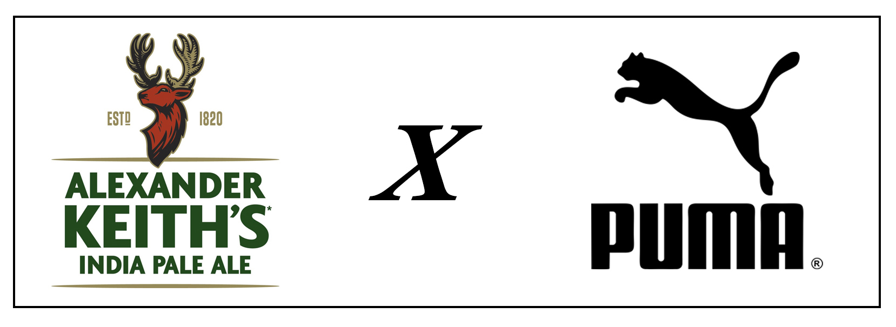

# Midterm Integrated Project

### Overview
This is my midterm integrated project. The two brands that we are working with are Alexander Keith's and Puma - Speed Orbiter. The first page is the home of our brand mashup and features promotional images and info for the products that are featured. The second page is the product page, which presents the many different products available. The third page presents information all about the company. The fourth page is the contact page and includes many different ways to get in touch with the company, such as a contact form and social media links. The fifth and final page is the cart page which holds all the items that you want to purchase.  

Alexander Keith's is a brewing company found in Halifax, Nova Scotia and was founded in 1820. The company now sells many different beers with unique tastes that come from locally sourced products.

Puma Speed Orbiter are a style of shoe by Puma that was released on July 1st, 2019. The brand also sells many other clothing pieces focussed on style and athletics for both men and women.

### Getting Started
This is a basic HTML / CSS build.

To view the pages, clone this to the location of your choice, and open the ".html" file.

You can also view the source code by opening it in any code editing program of your choice, or clicking inspect in a chrome tab.

### Prerequisites
All you need to run these pages is an up to date browser.

## Authors
1. Greg Avery - Front End Dev & Designer
